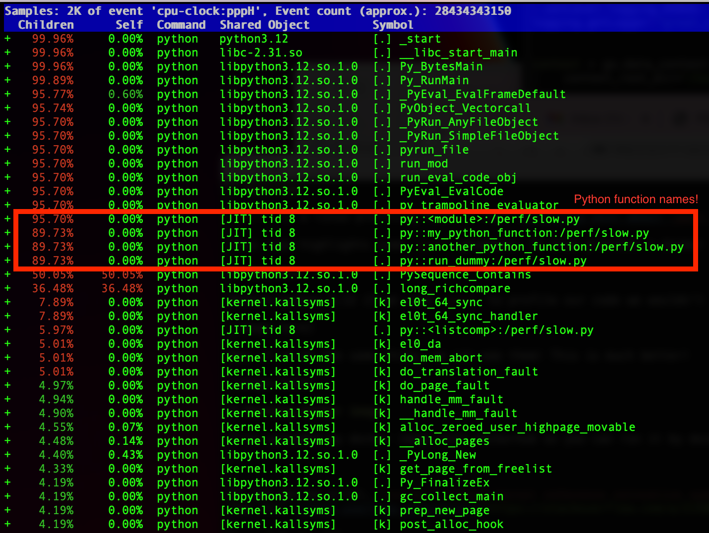
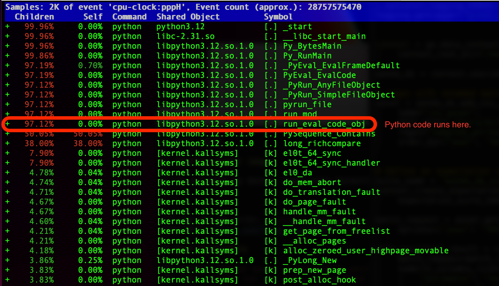

# Overview

`perf` is a linux profiling tool. I read [this blog post about `perf` coming to python 3.12](https://www.petermcconnell.com/posts/perf_eng_with_py12/) and I wanted to recreate it and experiment.

This repo highlights some `perf` goodness. It also provides the docker image I used on my m1 mac to play with `perf`.

# Goodness

Before python 3.12 if we used `perf` to profile our code we wouldn't see our python function names:



Now if we do the same thing, we can see them. This is much better!



# Running docker image

I've uploaded my docker image onto dockerhub so you can run it by doing:

```
docker run -it --rm --privileged --mount type=bind,source=${PWD},target=/perf/to_local bdirks/pyperf:latest bash
```

If you get an error, `Couldn't record kernel reference relocation symbol`, you may need to run `sysctl -w kernel.kptr_restrict=1` in the docker container.
See this [stack overflow discussion](https://stackoverflow.com/a/21588642).

# perf Dockerfile

To build: `docker build -f Dockerfile.perf --tag pyperf:latest .`

To run: `docker run -it --rm --privileged --mount type=bind,source=${PWD},target=/perf/to_local pyperf:latest bash`

# perf Commands

Running python with perf support.

```
# Run perf on a slow python file (~30 s)
perf record -F 99 -g -- python slow.py

# See profiling report
perf report -g -i perf.data

# Create flamegraph svg on local directory
perf_5.10 script > out.perf
/FlameGraph/stackcollapse-perf.pl out.perf > out.folded
/FlameGraph/flamegraph.pl out.folded > to_local/perf_example.svg
```

To see the profiling report without python symbols, restart the docker image, turn off python perf support, `unset PYTHONPERFSUPPORT`, and rerun the commands above.
